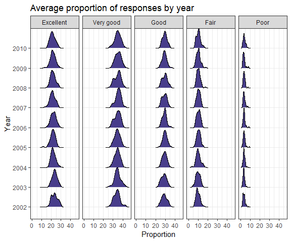

p8105\_hw3\_smi2112
================
Stephanie Izard

Problem 1
---------

Loading BRFSS data from p8105.datasets package:

``` r
brfss <- p8105.datasets::brfss_smart2010
```

Data cleaning: Use appropriate names, focus on the "Overall Health" topic, include only responses from "Excellent" to "Poor", organize responses as a factor taking levels ordered from "Excellent" to "Poor".

``` r
brfss = brfss %>% 
  janitor::clean_names() %>% 
  rename(state = locationabbr, county = locationdesc) %>% 
  filter(topic == "Overall Health") %>% 
  mutate(response = forcats::fct_relevel(response, c("Excellent", "Very good", "Good", "Fair","Poor")))
```

Question: In 2002, which states were observed at 7 locations? Answer: 3 states were observed at exactly 7 distinct locations in 2002: CT, FL, and NC.

``` r
brfss %>% 
  filter(year == 2002) %>% 
  select(state, county) %>% 
  group_by(state) %>% 
  distinct() %>% 
  count(state) %>% 
  filter(n == 7) %>% 
  knitr::kable()
```

| state |    n|
|:------|----:|
| CT    |    7|
| FL    |    7|
| NC    |    7|

Spaghetti plot showing the number of distinct locations in each state from 2002 to 2010:

``` r
brfss %>%
  select(year, state, county) %>% 
  distinct(year, state, county) %>% 
  group_by(year, state) %>% 
  mutate(locations = n()) %>% 
  ggplot(aes(x = year, y = locations, color = state)) +
    geom_line() +
    labs(title = "Number of locations in each state from 2002 to 2010", x = "Year", y = "Number of locations") +
    viridis::scale_color_viridis(option = "viridis", discrete = TRUE) +
    theme_bw() +
    theme(legend.position = "bottom")
```


Table showing for the years 2002, 2006, and 2010 the mean and std of the proportion of "Execllent" responses across locations in NYS:

``` r
brfss %>% 
  filter(state == "NY") %>% 
  filter(year == 2002 | year == 2006 | year == 2010) %>% 
  select(year, county, response) %>% 
  group_by(year) %>% 
  summarize("mean" = mean(response == "Excellent"), "std" = sd(response == "Excellent")) %>% 
  knitr::kable()
```

|  year|  mean|        std|
|-----:|-----:|----------:|
|  2002|   0.2|  0.4082483|
|  2006|   0.2|  0.4068381|
|  2010|   0.2|  0.4045199|

For each year and state, the average proportion in each response category:

``` r
brfss %>%
  select(year, state, response, data_value) %>%
  rename(proportion = data_value) %>% 
  mutate(year = as.factor(year)) %>% 
  group_by(year, state, response) %>% 
  summarize(mean_prop = mean(proportion))
```

    ## # A tibble: 2,215 x 4
    ## # Groups:   year, state [?]
    ##    year  state response  mean_prop
    ##    <fct> <chr> <fct>         <dbl>
    ##  1 2002  AK    Excellent      27.9
    ##  2 2002  AK    Very good      33.7
    ##  3 2002  AK    Good           23.8
    ##  4 2002  AK    Fair            8.6
    ##  5 2002  AK    Poor            5.9
    ##  6 2002  AL    Excellent      18.5
    ##  7 2002  AL    Very good      30.9
    ##  8 2002  AL    Good           32.7
    ##  9 2002  AL    Fair           12.1
    ## 10 2002  AL    Poor            5.9
    ## # ... with 2,205 more rows

A five-panel plot showing the distribution of the above state level averages over time:

``` r
brfss %>%
  select(year, state, response, data_value) %>%
  rename(proportion = data_value) %>% 
  mutate(year = as.factor(year)) %>% 
  group_by(year, state, response) %>% 
  summarize(mean_prop = mean(proportion)) %>% 
  ggplot(aes(x = mean_prop, y = year)) +
    geom_density_ridges(scale = 1, fill = "darkslateblue") +
    facet_grid(~ response) +
    labs(title = "Average proportion of responses by year", x = "Proportion", y = "Year") + 
    theme_bw()
```

    ## Picking joint bandwidth of 1.07

    ## Picking joint bandwidth of 1.21

    ## Picking joint bandwidth of 0.994

    ## Picking joint bandwidth of 0.795

    ## Picking joint bandwidth of 0.378

    ## Warning: Removed 21 rows containing non-finite values
    ## (stat_density_ridges).


