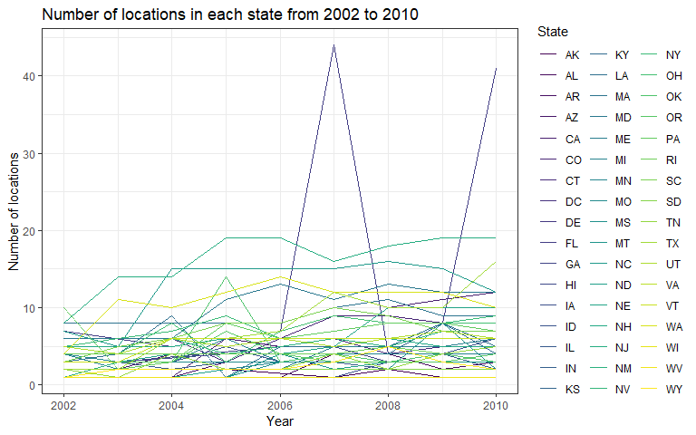
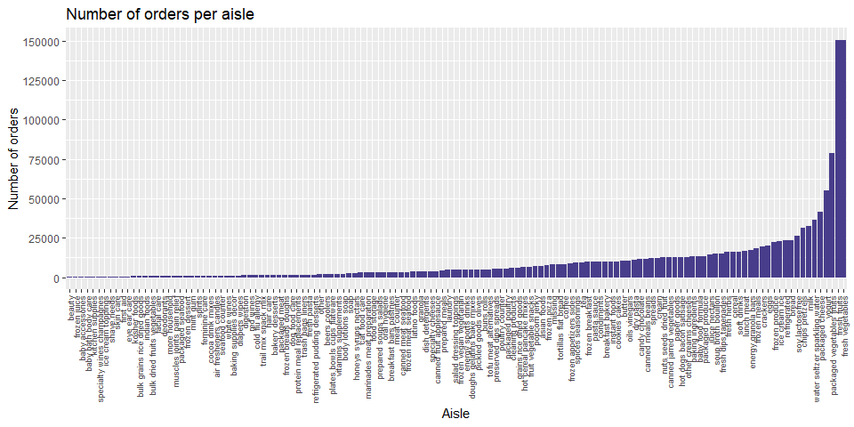

p8105\_hw3\_smi2112
================
Stephanie Izard

Problem 1
---------

Loading BRFSS data from p8105.datasets package:

``` r
brfss <- p8105.datasets::brfss_smart2010
```

Data cleaning: Use appropriate names, focus on the "Overall Health" topic, include only responses from "Excellent" to "Poor", organize responses as a factor taking levels ordered from "Excellent" to "Poor".

``` r
brfss = brfss %>% 
  janitor::clean_names() %>% 
  rename(state = locationabbr, county = locationdesc) %>% 
  filter(topic == "Overall Health") %>% 
  mutate(response = forcats::fct_relevel(response, c("Excellent", "Very good", "Good", "Fair","Poor")))
```

Question: In 2002, which states were observed at 7 locations? Answer: 3 states were observed at exactly 7 distinct locations in 2002: CT, FL, and NC.

``` r
brfss %>% 
  filter(year == 2002) %>% 
  select(state, county) %>% 
  group_by(state) %>% 
  distinct() %>% 
  count(state) %>% 
  filter(n == 7) %>% 
  rename("State" = state, "Number of Locations" = n) %>% 
  knitr::kable()
```

| State |  Number of Locations|
|:------|--------------------:|
| CT    |                    7|
| FL    |                    7|
| NC    |                    7|

Spaghetti plot showing the number of distinct locations in each state from 2002 to 2010:

``` r
brfss %>%
  select(year, state, county) %>% 
  distinct(year, state, county) %>% 
  group_by(year, state) %>% 
  mutate(locations = n()) %>% 
  ggplot(aes(x = year, y = locations, color = state)) +
    geom_line() +
    labs(title = "Number of locations in each state from 2002 to 2010", x = "Year", y = "Number of locations") +
    viridis::scale_color_viridis(option = "viridis", discrete = TRUE, name = "State") +
    theme_bw()
```



Table showing for the years 2002, 2006, and 2010 the mean and std of the proportion of "Execllent" responses across locations in NYS:

``` r
brfss %>% 
  filter(state == "NY") %>% 
  filter(year == 2002 | year == 2006 | year == 2010) %>% 
  select(year, county, response) %>% 
  group_by(year) %>% 
  summarize("Mean" = mean(response == "Excellent"), "Std" = sd(response == "Excellent")) %>% 
  rename("Year" = year) %>% 
  knitr::kable()
```

|  Year|  Mean|        Std|
|-----:|-----:|----------:|
|  2002|   0.2|  0.4082483|
|  2006|   0.2|  0.4068381|
|  2010|   0.2|  0.4045199|

For each year and state, the average proportion in each response category:

``` r
brfss %>%
  select(year, state, response, data_value) %>%
  rename(proportion = data_value) %>% 
  mutate(year = as.factor(year)) %>% 
  group_by(year, state, response) %>% 
  summarize(mean_prop = mean(proportion))
```

    ## # A tibble: 2,215 x 4
    ## # Groups:   year, state [?]
    ##    year  state response  mean_prop
    ##    <fct> <chr> <fct>         <dbl>
    ##  1 2002  AK    Excellent      27.9
    ##  2 2002  AK    Very good      33.7
    ##  3 2002  AK    Good           23.8
    ##  4 2002  AK    Fair            8.6
    ##  5 2002  AK    Poor            5.9
    ##  6 2002  AL    Excellent      18.5
    ##  7 2002  AL    Very good      30.9
    ##  8 2002  AL    Good           32.7
    ##  9 2002  AL    Fair           12.1
    ## 10 2002  AL    Poor            5.9
    ## # ... with 2,205 more rows

A five-panel plot showing the distribution of the above state level averages over time:

``` r
brfss %>%
  select(year, state, response, data_value) %>%
  rename(proportion = data_value) %>% 
  mutate(year = as.factor(year)) %>% 
  group_by(year, state, response) %>% 
  summarize(mean_prop = mean(proportion)) %>% 
  ggplot(aes(x = mean_prop, y = year)) +
    geom_density_ridges(scale = 1, fill = "darkslateblue") +
    facet_grid(~ response) +
    labs(title = "Average proportion of responses by year", x = "Proportion", y = "Year") + 
    theme_bw()
```

    ## Picking joint bandwidth of 1.07

    ## Picking joint bandwidth of 1.21

    ## Picking joint bandwidth of 0.994

    ## Picking joint bandwidth of 0.795

    ## Picking joint bandwidth of 0.378

    ## Warning: Removed 21 rows containing non-finite values
    ## (stat_density_ridges).


Problem 2
---------

Loading instacart data:

``` r
instacart <- p8105.datasets::instacart
```

Short description of dataset:

The size of the dataset is 1384617, 15 (1384617 observations/ rows and 15 variables/ columns) and is in long format. The variable "order\_id" is a number unique to each individual order, the variable "order\_dow" is the day of the week the order was placed (0 = Sunday), "order\_hour\_of\_day" is the hour of the day when the order was placed, "product\_name" is the product name, "aisle\_id" is a number unique to each aisle, and "aisle" is the name of the aisle. The dataset, "The Instacart Online Grocery Shopping Dataset 2017", comes from Instacart, an online grocery service. There were 131209 unique order identification numbers. 0, 324026 total products were ordered on a Sunday.

Number of aisles, most popular aisles:

There are 134 different aisles in the store. Aisle number 83 has the most items ordered from it, with a total of 150609 products. Aisle number 24 has the second most items ordered from it, with a total of 150473 products.

``` r
instacart %>% 
  select(aisle_id) %>% 
  n_distinct()
```

    ## [1] 134

``` r
instacart %>% 
  select(aisle_id) %>% 
  group_by(aisle_id) %>% 
  count(aisle_id) %>% 
  arrange(desc(n))
```

    ## # A tibble: 134 x 2
    ## # Groups:   aisle_id [134]
    ##    aisle_id      n
    ##       <int>  <int>
    ##  1       83 150609
    ##  2       24 150473
    ##  3      123  78493
    ##  4      120  55240
    ##  5       21  41699
    ##  6      115  36617
    ##  7       84  32644
    ##  8      107  31269
    ##  9       91  26240
    ## 10      112  23635
    ## # ... with 124 more rows

Plot showing the number of items ordered in each aisle:

``` r
instacart %>% 
  select(aisle) %>% 
  group_by(aisle) %>% 
  summarize(n = n()) %>% 
  mutate(aisle = forcats::fct_reorder(aisle, n)) %>% 
  arrange(desc(n)) %>% 
  ggplot(aes(x = aisle, y = n)) + 
    geom_histogram(stat = "identity", fill = "darkslateblue") +
    scale_y_continuous(limits = c(0, 150700), breaks = c(0, 25000, 50000, 75000, 100000, 125000, 150000)) + 
    labs(title = "Number of orders per aisle", x = "Aisle", y = "Number of orders") +
    theme(axis.text.x = element_text(angle = 90, vjust = 0.5, hjust = 1, size = 7))
```

    ## Warning: Ignoring unknown parameters: binwidth, bins, pad



Table showing most popular items for "baking ingredients", "dog food care", and "packaged vegetables fruits":

``` r
instacart %>% 
  filter(aisle == "baking ingredients" | aisle == "dog food care" | aisle == "packaged vegetables fruits") %>% 
  select(aisle, product_name, order_id) %>% 
  group_by(aisle, product_name) %>% 
  summarize(n = n()) %>% 
  filter(n == max(n)) %>% 
  rename("Aisle" = aisle, "Most Popular Product" = product_name, "Number of Orders" = n) %>% 
  knitr::kable()
```

| Aisle                      | Most Popular Product                          |  Number of Orders|
|:---------------------------|:----------------------------------------------|-----------------:|
| baking ingredients         | Light Brown Sugar                             |               499|
| dog food care              | Snack Sticks Chicken & Rice Recipe Dog Treats |                30|
| packaged vegetables fruits | Organic Baby Spinach                          |              9784|

Table showing the mean hour of the day at which Pink Lady Apples and Coffee Ice Cream are ordered on each day of the week:

``` r
instacart %>% 
  select(product_name, order_hour_of_day, order_dow) %>%
  mutate(order_dow = factor(order_dow, levels = c(0,1,2,3,4,5,6), labels = c("Sunday", "Monday", "Tuesday", "Wednesday", "Thursday", "Friday", "Saturday"))) %>% 
  filter(product_name == "Pink Lady Apples" | product_name == "Coffee Ice Cream") %>% 
  group_by(product_name, order_dow) %>% 
  summarize(hour_mean = mean(order_hour_of_day)) %>% 
  spread(key = order_dow, value = hour_mean) %>% 
  rename("Product Name" = product_name) %>% 
  knitr::kable()
```

| Product Name     |    Sunday|    Monday|   Tuesday|  Wednesday|  Thursday|    Friday|  Saturday|
|:-----------------|---------:|---------:|---------:|----------:|---------:|---------:|---------:|
| Coffee Ice Cream |  13.77419|  14.31579|  15.38095|   15.31818|  15.21739|  12.26316|  13.83333|
| Pink Lady Apples |  13.44118|  11.36000|  11.70213|   14.25000|  11.55172|  12.78431|  11.93750|

Problem 3
---------

Loading NY NOAA data:

``` r
ny_noaa <- p8105.datasets::ny_noaa
```

Short description of dataset:

The size of the dataset is 2595176, 7 (2595176 observations/ rows and 7 variables/ columns) and is in long format. The variable "id" is weather station ID, "date" is the date of observation, "prcp" is amount of precipitation measured in tenth of mm, "snow" is amount of snowfall measured in mm, "snwd" is snow depth measured in mm, "tmax" is the maximum temperature measured in tenths of degrees C, and "tmin" is the minimum temperature measured in tenths of degrees C. The dataset contains extensive missing data, as each weather station may only collect a subset of these variables. The table created below (missing\_data) summarizes the proportion of missing variables at each station.

``` r
missing_data <- ny_noaa %>% 
  group_by(id) %>% 
  summarize_all(funs(mean(is.na(.))))
```

Data cleaning:

``` r
ny_noaa <- ny_noaa %>% 
  separate(date, into = c("year", "month", "day"), sep = "-") %>% 
  mutate(year, as.integer(year)) %>%
  mutate_at(vars(prcp:tmin), as.numeric) %>% 
  mutate(tmax = tmax / 10,
         tmin = tmin / 10,
         prcp = prcp / 100, 
         snow = snow / 10, 
         snwd = snwd / 10)
```

Date was sepparated into year, month, and day. Maximum and minimum temperature were changed from tenths of degrees C to degrees C. Precipitation was changed from tenths of a mm to cm. Snowfall and snow depth were changed from mm to cm.

The most commonly observed snowfall value is 0 cm. The second most commonly observed snowfall is 2.5 cm. It is logical that the top most observed snowfall is 0 cm because

``` r
ny_noaa %>% 
  group_by(snow) %>% 
  summarize(n = n()) %>% 
  arrange(desc(n))
```

    ## # A tibble: 282 x 2
    ##     snow       n
    ##    <dbl>   <int>
    ##  1   0   2008508
    ##  2  NA    381221
    ##  3   2.5   31022
    ##  4   1.3   23095
    ##  5   5.1   18274
    ##  6   7.6   10173
    ##  7   0.8    9962
    ##  8   0.5    9748
    ##  9   3.8    9197
    ## 10   0.3    8790
    ## # ... with 272 more rows

Two-panel plot showing the average max temperature in January and in July in each station across years:

``` r
ny_noaa %>% 
  filter(month == "01" | month == "07") %>% 
  mutate(month = if_else(month == "01", "January", "July")) %>% 
  group_by(id, year, month) %>% 
  summarize(avg_tmax = mean(tmax, na.rm = TRUE)) %>% 
  ggplot(aes(x = year, y = avg_tmax, group = id)) +
  geom_line(color = "darkslateblue") +
  facet_grid(~ month) +
  labs(title = "Average maximum temperature at each site in January and July from 1981 to 2010 in NYS", x = "Year", y = "Temperature (Degrees C)") +
  theme_bw() +
  theme(axis.text.x = element_text(angle = 90, size = 7)) 
```

    ## Warning: Removed 5640 rows containing missing values (geom_path).


Two-panel plot showing (i) tmax vs tmin for the full dataset and (ii) the distribution of snowfall values between 0 and 100 separately by year:

``` r
library(patchwork)

plot1 <- ggplot(ny_noaa, aes(x = tmax, y = tmin)) +
  geom_hex() +
  labs(title = "Maximum by minimum temperature", x = "Maximum temperature (Degrees C)", y = "Minimum temperature (Degrees C)") +
  viridis::scale_fill_viridis(option = "plasma") + 
  theme_bw()

plot2 <- ny_noaa %>% 
  filter(snow >= 0 & snow <= 100) %>% 
  ggplot(aes(x = snow, y = year)) +
  geom_density_ridges(scale = 0.9, fill = "darkred") + 
  labs(title = "Snow fall distribution per year", x = "Snowfall (cm)", y = "Year") +
  theme_bw()

plot1 + plot2
```

    ## Warning: Removed 1136276 rows containing non-finite values (stat_binhex).

    ## Picking joint bandwidth of 0.236


